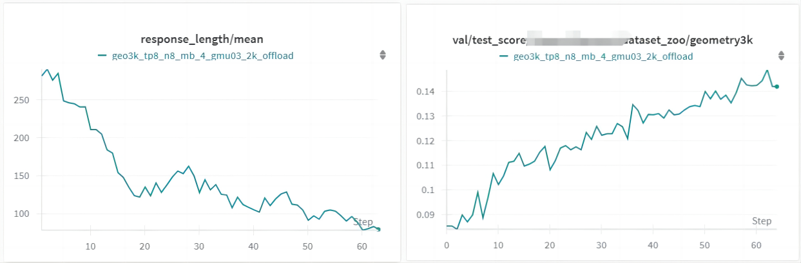
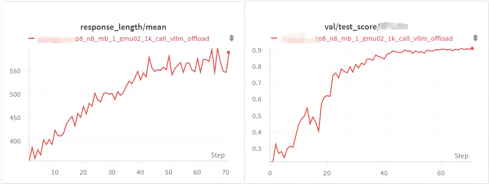

# GRPO for Llava (Based on Verl)

[](https://opensource.org/licenses/Apache-2.0)
[](https://www.python.org/downloads/)

## What this project do

There are no open-sourced GRPO algorithm based on the LLaVA architecture, so we filled this gap.


## Features

### Supported Models

- All LLMs && VLMs supported by Verl
- Any VLM based on Llava architecture

### Supported Algorithms

- All algorithms supported by Verl

### Supported Datasets

- Any multimodal or text-only dataset


## Installation

Installation steps are consistent with Verl. Please refer to the [Verl Documentation](https://verl.readthedocs.io/en/latest/start/install.html).

**Critical Modifications Required:**  
To ensure successful training, you must modify the following files in your environment's transformers package:

1. Modify `modeling_llava.py` at:  
   `envs/verl/lib/python3.10/site-packages/transformers/models/llava/modeling_llava.py`

```python
class LlavaPreTrainedModel(PreTrainedModel):
    config_class = LlavaConfig
    base_model_prefix = "model"
    supports_gradient_checkpointing = True
-    # _no_split_modules = ["LlavaVisionAttention"]
+    _no_split_modules = ["CLIPEncoderLayer", "LlamaDecoderLayer"]
    _skip_keys_device_placement = "past_key_values"
    _supports_cache_class = True
    _supports_flash_attn_2 = True
    _supports_sdpa = True
    _supports_quantized_cache = True
    _supports_static_cache = True
```

2. Add `max_position_embeddings` parameter in `configuration_llava.py` at:  
   `envs/verl/lib/python3.10/site-packages/transformers/models/llava/configuration_llava.py`

```python
    model_type = "llava"
    sub_configs = {"text_config": AutoConfig, "vision_config": AutoConfig}
    is_composition = True

    def __init__(
        self,
        vision_config=None,
        text_config=None,
        image_token_index=32000,
        projector_hidden_act="gelu",
        vision_feature_select_strategy="default",
        vision_feature_layer=-2,
        image_seq_length=576,
+        max_position_embeddings=32768,
        multimodal_projector_bias=True,
        **kwargs,
    ):
```

## QuickStart: Run llava1.5-7b-hf on [Geometry3K](https://huggingface.co/datasets/hiyouga/geometry3k) Dataset

**Ensure you have completed all steps in the Installation section before proceeding.**

### GRPO Training

```bash
cd verl
bash example/run_llava1_5-7b.sh
```

### Checkpoint Merging

```bash
python verl/utils/checkpoint/reverse_ckpt.py --ckpt_path "checkpoints/verl_grpo_llava_run/geo3k_tp8_n8_mb_4_gmu03_2k_offload" --step 64 --output_path "model_zoo/llava1.5-grpo"
```

## Experimental Results

We conducted training experiments on two LLaVA-architecture models using 8×40GB A800 GPUs. Our results indicate that the llava1.5-7b model, due to its performance limitations, struggles to generate high-quality long reasoning paths. During training, this results in progressively shorter chains of thought with diminished meaningful content, a phenomenon also noted in MedVLM-r1.  

In contrast, a more capable LLaVA-architecture model (represented by the red curve) demonstrates a reasoning length that continuously extends throughout training, aligning well with GRPO training’s expected behavior. This highlights the importance of a stronger backbone in sustaining meaningful reasoning during optimization.  







> **Note**  
> This implementation demonstrates GRPO's Llava compatibility, though the outdated Llava-1.5 architecture shows limited effectiveness. We recommend modern Llava variants (Llava-NeXT/Llava-Phi) for production-grade performance.


# Citation
Our project is modified based on [Verl](https://github.com/volcengine/verl). If it is helpful to you, please cite us.

```bibtex
@misc{GRPO4llava,
  title        = {GRPO for Llava},
  author       = {Yang, Lele and Diao, Muxi and Liang, Kongming and Ma, Zhanyu},
  howpublished = {\url{https://github.com/   }},
  year         = {2025}
}

```


We recommend to also cite the original work.

```bibtex
@article{sheng2024hybridflow,
  title   = {HybridFlow: A Flexible and Efficient RLHF Framework},
  author  = {Guangming Sheng and Chi Zhang and Zilingfeng Ye and Xibin Wu and Wang Zhang and Ru Zhang and Yanghua Peng and Haibin Lin and Chuan Wu},
  year    = {2024},
  journal = {arXiv preprint arXiv: 2409.19256}
}
```

